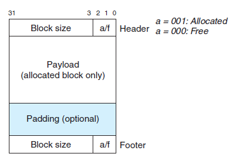
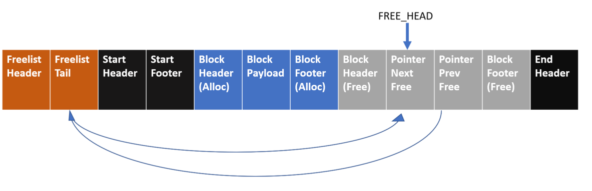
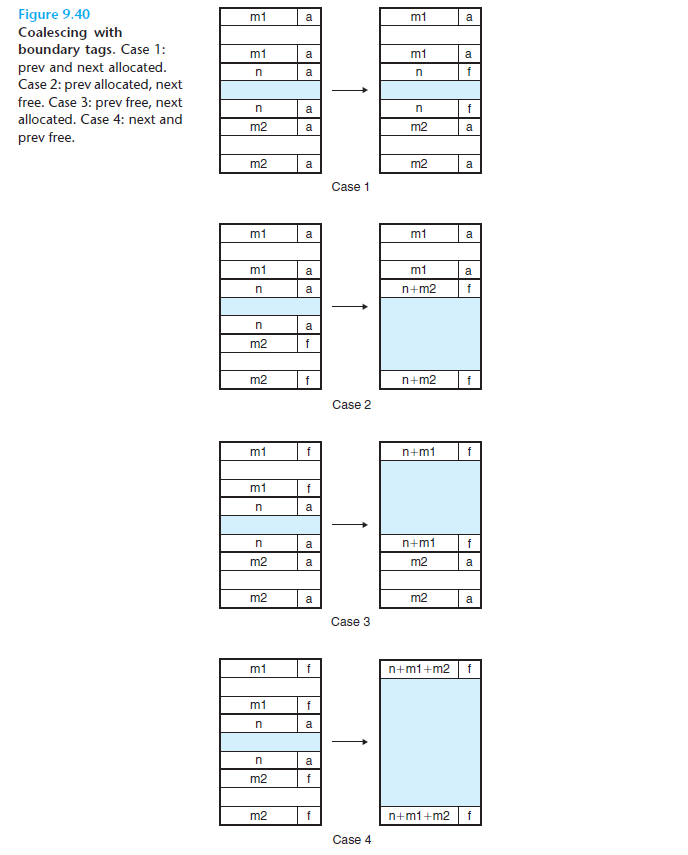

# MyMalloc
Implementation of malloc and free using explicit FILO free list

## Section 1: Requirements and summary of development. 

**Disclaimer: The skeleton of the code refers to** **Computer System: A Programmer's Perspective 3rd Edition Global Edition (CSAPP) Chapter 9.9** 

The malloc was implemented with three different selection policies (first fit, best fit, second fit) using an explicit free list that was managed in a FILO manner and implemented immediate coalesce when a block was freed.  The implementation refers to Computer System: A programmer’s perspective. 

The implementation was finished in Ubuntu 20.1 within the Windows Subsystem of Linux. The development was also along with GCC, make, and Valgrind. 

The remaining report contains the following content: In section 2, we will illustrate the design of the program and some important details about the implementation. In Section 3, we will report the performance result with some analysis.   

## Section 2: Design, implementation, and test 

### Memory Layout

The malloc function manages memory resources using blocks. Each block uses a header and a footer to store the metadata. the blocks are double-word aligned (aligned with 8 bytes). The double-word alignment would equip our malloc function with better performance. As aligning memory with 8 bytes can ensure that you can always access data in one CPU clock cycle. 

Here is a sample layout of a block (figure from CSAPP page 883). As the block is 8 bytes aligned, the 3 lower bits would always be 0 for size. Thus, we can use these three bits to store the state of the block: Allocated/Free. The Block also has a footer that contains exactly the same message as the header. Although seems redundant, the footer is critical to achieving efficient coalesce.  Between the header and footer is the payload of the block. A pointer point to the payload would be returned to the user. Padding would be added to the block to maintain the alignment.



The blocks will be placed between two special tags adjacently. Here is a figure depicting the layout of the block. At the beginning and the end of the heap, there will be two special blocks that indicate the start and the end of the heap region. Such a design helps the implementation get rid of dealing with the tedious corner cases when allocating/free blocks. 

The very beginning of the layout is another special block that holds the tail of the free list. A static global pointer will always point to the head of the free list. 

  

There is another design of a free list that worth to be mentioned. As only the free blocks need to be added to the free list, we store the prev and next pointer inside the payload section of the free block. It occupied a total of 16 bytes right after the block header. Such a design reduced memory utilization, the memory inside the free block will not be used by the user and the allocated block does not need to store the pointer. 

A disadvantage of such a design is that such design requires the minimum block size to become 24 bytes (4 bytes header + 4 bytes footer + 2 * 8 bytes pointers). When users frequently asked for a small chunk of memories, the overhead could be large. 

### Coalesce

Another feature that we implemented is the immediate coalesce. Whenever a block was freed, it will check if its adjacent blocks are free. If so, it will coalesce with the adjacent blocks. 

The header and footer would be quite important for the coalesce, they are used to check if the adjacent blocks are allocated or free and locate the position of each adjacent block to conduct the coalesce. 

The implementation of Coalesce can be generally separated into 6 steps: 

1. Read allocate/free bit from the footer/header of the adjacent blocks
2. (if any of the adjacent blocks is free) delete the free block from the free list
3. marge current block with the adjacent block: re-compute the size and update the header/footer of the new blocks
4. Then add the merged block on the head free list
5. return the pointer to the new block

The figure below demonstrates the mechanisms of updating the header and footer during the coalescing.



### Allocate

The allocate function would invoke the `find_fit` function to seek for a position to allocate the new block. If no free blocks are large enough, acquire additional memory using `sbrk`.   

If a sufficiently large block exists, the `place` function would be invoked. If would place the allocated block inside the given free block. If the remaining space is large enough, it would split a new free block out and update the free list. 

The implementation of find_fit is quite simple, the search starts from the static pointer FREE_HEAD and goes all the way back through the prev pointer. 

In this project, we implemented two different three different selection policies, first fit, second fit, and best fit. Here is a plot that demonstrates the concept of first fit and best fit. 

The second fit is a modification of the first fit. It was invented by Donald Knuth. The idea of the second fit it that the first fit tends to fill the nearest big chunks, which may increase the searching time for big chunks (you need to iterate a longer time). Compared with the first fit, the second fit can leave some sparse big chunks at the beginning, thus accelerating the finding time. 

### Macros

One of the super cool techniques I implemented in this chapter is the use of macros. Most macros was refers to the implementation in CSAPP. 

Macro is a great substitute for function. They can be applied to generic type and will automatically expand be the preprocessor thus no function call and return are needed (which are likely to break the pipeline of the instructions). 

Here are some of them

```C
#define WSIZE 4             /* single word size */
#define DSIZE 8             /* double word size */
#define MSIZE 24            /* minimum block size*/
#define CHUNKSIZE (1 << 12) /* size require by sbrk */

#define MAX(x, y) ((x) > (y) ? (x) : (y))
#define PACK(size, alloc) ((size) | (alloc))

/* read word from the given pointer */
// use unsigned int cast to make pointer 32 bits
#define GET(p) (*(unsigned int *)(p))
#define PUT(p, val) (*(unsigned int *)(p) = (val))
#define PUT_LONG(p, val) (*(void **)(p) = (val))

/* functions to read header*/
#define GET_SIZE(p) (GET(p) & ~0x7)
#define GET_ALLOC(p) (GET(p) & 0x1)

/* functions to get header address and footer address*/
#define HDRP(bp) ((char *)(bp)-WSIZE)
#define FTRP(bp) ((char *)(bp) + GET_SIZE(HDRP(bp)) - DSIZE)

/* round up to the nearest align */
#define ALIGN(len) (((len) + DSIZE - 1) & ~0x7)

/* compute ptr to next and prev block*/
#define NEXT_BLKP(bp) ((char *)(bp) + GET_SIZE(((char *)(bp)-WSIZE)))
#define PREV_BLKP(bp) ((char *)(bp)-GET_SIZE(((char *)(bp)-DSIZE)))

/* Get pointer of free list */
#define GET_NEXT_FREE(bp) ((void **)(bp))
#define GET_PREV_FREE(bp) ((void **)((char *)(bp) + DSIZE))

/* jump through free list*/
#define PREV_FREE(bp) (*GET_PREV_FREE(bp))
#define NEXT_FREE(bp) (*GET_NEXT_FREE(bp))
```

## Section 3: Performance Results & Analysis

In this section, we compared the performance of different implementations of malloc. There are in total four different implementations that are benchmarked: implementation of explicit malloc with first fit find, second fit find, best fit find respectively, and a malloc implementation with an implicit free list and first fit find comes from CSAPP.  Here is a summary of the performance for each implementation based on the provided test. 

| implementation        | small range rand           | large range rand | euqal size alloc |
| --------------------- | -------------------------- | ---------------- | ---------------- |
| implicit + first fit  | 27.9s/0.71 (time/fragment) | 69.5s/0.82       | 290s/0.99        |
| explicit + first fit  | 0.07ss/0.997               | 0.26s/0.99       | 0.49s/0.998      |
| explicit + second fit | 0.08s/0.02                 | 0.3s/0.996       | 0.51s/0.02       |
| explicit + best fit   | 3.29s/0.07                 | 38.6s/0.94       | 0.48s/0.02       |

From the data, we could see that the first fit find is significantly faster than the best fit. The explicit free list achieves thousands of times acceleration. The second fit find, however, does show any performance advantage compared with the first fit. Such a situation may result from the free list of our test cases not being long enough to show the performance issues. 

About the fragment, the best fit does not show a large different compared with the second fit. From my understanding of the fragment provided in this project, I don't think it is a good metric for memory utilization, as fragmentation actually largely depends on the design of test cases (order of the malloc, free sequence, and size among malloc). And also, this metric does not take internal fragments and the metadata space into account. A better metric might be the peak ratio between the actual payload and the total heap size. This metric would catch the overhead of the metadata and the internal fragment. While due to the time limit, the metric was not tested in this project.    
